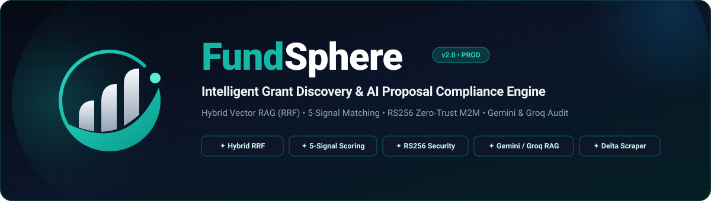

<p align="center">
  <picture>
    <source media="(prefers-color-scheme: dark)" srcset="assets/fundsphere-banner.svg">
    <source media="(prefers-color-scheme: light)" srcset="assets/fundsphere-banner.svg">
    
  </picture>
</p>

<p align="center">
  <strong>Next-generation AI platform bridging researchers, academic institutions, and startups with high-impact global funding opportunities.</strong>
</p>

<p align="center">
  <a href="#architecture-overview"></a>
  <a href="#key-features"></a>
  <a href="#frontend-application-routes"></a>
  <a href="#quickstart"></a>
  <a href="#quickstart"></a>
  <a href="#machine-to-machine-m2m-rsa-key-setup"></a>
</p>

<p align="center">
  <a href="#architecture-overview">Architecture Overview</a> &nbsp;•&nbsp;
  <a href="#frontend-application-routes">Frontend Routes</a> &nbsp;•&nbsp;
  <a href="#key-features">Key Features</a> &nbsp;•&nbsp;
  <a href="#how-ai-match-works">AI Match Engine</a> &nbsp;•&nbsp;
  <a href="#scraping--indexing-pipeline">Delta Scraper Pipeline</a> &nbsp;•&nbsp;
  <a href="#quickstart">Quickstart</a> &nbsp;•&nbsp;
  <a href="#documentation-links">Documentation</a>
</p>

---

<a id="about-fundsphere"></a>
## 🧭 About FundSphere

**FundSphere** combines hybrid retrieval (**Pinecone** vector embeddings + **PostgreSQL** lexical keyword search), **Reciprocal Rank Fusion (RRF)**, **cross-encoder reranking** (`bge-reranker-v2-m3`), and two-pass delta web scraping to surface funding opportunities tailored to a researcher's academic profile.

Every recommendation includes an **explainable match score breakdown** (5 signals), hard eligibility guardrails to eliminate false positives, and an **AI Proposal Assistant** with multi-LLM resiliency (**Google Gemini 2.5** with automatic failover to **Groq Llama 4**).

> [!TIP]
> **Live Color Theme**: FundSphere's signature palette uses **Teal-600 (`#0d9488`)** and **Slate/Navy-900 (`#0f172a`)**, highlighting trust, precision, and modern intelligence.

---

<a id="architecture-overview"></a>
## 🏛️ Architecture Overview

FundSphere is structured as a resilient three-tier microservice system with strict separation of concerns across the client interface, transaction persistence, and asynchronous vector intelligence.

```
┌────────────────────────────────┐            ┌────────────────────────────────┐            ┌────────────────────────────────┐
│      Frontend (Port 5173)      │   HTTP     │    CoreBackend (Port 8080)     │  M2M JWT   │     AI-Service (Port 8000)     │
│     React 19 + TypeScript      │ ─────────▶ |     Java 21 + Spring Boot      │ ─────────▶│        Python + FastAPI        |
│     Tailwind CSS v4 + Vite     │ (User JWT) │     PostgreSQL + M2M RS256     │ ◀───────── │     Pinecone + Groq/Gemini     |
└────────────────────────────────┘            └───────────────┬────────────────┘  (RS256)   └───────────────┬────────────────┘
                                                              │                                             │
                                                       ┌──────▼──────┐                               ┌──────▼──────┐
                                                       │ PostgreSQL  │                               │  Pinecone   │
                                                       │  Database   │                               │  Vector DB  │
                                                       └─────────────┘                               └─────────────┘
```

| Layer | Stack | Key Responsibilities |
|---|---|---|
| **`frontend/`** | React 19, Vite 7 (SWC), TypeScript, Tailwind CSS v4, React Router v7, Framer Motion, Lucide Icons | Responsive UI, animated landing showcase, researcher onboarding wizard with ORCID auto-fill, AI match feed, proposal assistant workspace |
| **`CoreBackend/`** | Java 21, Spring Boot 4.0.3, Spring Data JPA / Hibernate, PostgreSQL, JWT Authentication | User auth & token refresh, RS256 M2M asymmetric token service, researcher profiles, grant CRUD & keyword search, AI service bridge, background reindexing sweeper |
| **`ai-service/`** | Python 3.11+, FastAPI, Pinecone, Google Gemini 2.5, Groq Llama 4, Firecrawl, Selenium | Vector embeddings, HyDE query expansion, hybrid search fusion (RRF), cross-encoder reranking, 5-signal dynamic scoring, proposal compliance auditing, delta scraping |

---

<a id="frontend-application-routes"></a>
## 🖥️ Frontend Application Routes

The client interface offers a polished single-page experience tailored for high researcher productivity:

| Route | View | Description |
|---|---|---|
| `/` & `/landing` | **Landing Page** | Flagship public showcase featuring dynamic hero metrics, interactive value propositions, platform stats, and feature highlights |
| `/auth` | **Authentication** | Unified Login & Register forms with real-time password strength validation, animated transitions, and automatic JWT session recovery |
| `/onboarding` | **Researcher Wizard** | Multi-step onboarding flow with **one-click ORCID integration** to auto-fill research bio, career stage, and keywords, plus a **"Skip for now"** starter profile generator |
| `/discovery` | **Grant Discovery** | Dual-mode feed: **Browse Mode** with multi-faceted filtering & pagination, and **AI Match Mode** with 5-signal score breakdown, **keyboard shortcuts (`Ctrl+K` / `/`)**, and **interactive suggested topic chips** |
| `/saved` | **Saved Grants** | Bookmarked funding opportunities with PostgreSQL persistence, optimistic UI updates, and instant rollback handling |
| `/proposal` | **Proposal Assistant** | Dual-PDF compliance analyzer (proposal draft PDF + agency guidelines PDF) with Quick (~10s) and Deep (~30–90s) rubrics, section diff cards, and resilient **Groq failover** |
| `/profile` | **Profile Management** | Edit research interests, institution type, citizenship, degree requirements, notification preferences, and grant funding ceilings |

---

<a id="key-features"></a>
## ✨ Key Features

### 🎯 1. AI-Powered Grant Matching & Hybrid RAG
- **Hybrid Retrieval (RRF)**: Merges lexical keyword search from PostgreSQL with high-dimensional vector search hits from Pinecone, balancing exact terminology recall with semantic understanding.
- **Cross-Encoder Reranking**: Re-scores the top RRF candidate pool using Pinecone Inference with `bge-reranker-v2-m3`, drastically improving top-10 precision over single-vector retrieval.
- **HyDE (Hypothetical Document Embeddings)**: Generates synthetic grant solicitations tailored to user queries to bridge the vocabulary gap between researcher terminology and formal agency RFPs.
- **In-Memory Cache**: Deterministic SHA-256 hashing of researcher profiles and search criteria (`RecommendationCache`), caching top recommendations with TTL and LRU eviction for instantaneous sub-millisecond repeated lookups.

### ⚖️ 2. Transparent 5-Signal Dynamic Scoring & Guardrails
FundSphere breaks down every match into five explainable signals, augmented with hard eligibility guardrails:

```
┌────────────────────────────────────────────────────────────────────────┐
│                      5-SIGNAL COMPOSITE SCORING                        │
├────────────────────────────────┬─────────┬─────────────────────────────┤
│ Signal                         │ Weight  │ Description                 │
├────────────────────────────────┼─────────┼─────────────────────────────┤
│ 1. Semantic Similarity         │   35%   │ Vector embeddings + HyDE    │
│ 2. Eligibility Alignment       │   25%   │ Degree, citizenship, career │
│ 3. Keyword Match               │   15%   │ Lexical search overlap      │
│ 4. Funding Fit                 │   15%   │ Budget ceiling & grant size │
│ 5. Deadline Freshness          │   10%   │ Submission window recency   │
└────────────────────────────────┴─────────┴─────────────────────────────┘
```

> [!IMPORTANT]
> **Hard Non-Negotiable Guardrails**: Grants that strictly conflict with known profile constraints (PhD status, country/geographic eligibility, citizenship restrictions, or minimum years of experience) are immediately disqualified. Expired grants are automatically filtered out.

### 📝 3. AI Proposal Assistant with Multi-LLM Resilience
- **Dual-PDF Analysis**: Upload your draft proposal PDF alongside the official grant guidelines PDF.
- **Two Inspection Modes**:
  - **Quick Mode (~10s)**: Rapid single-pass evaluation for fast feedback on structure and alignment.
  - **Deep Mode (~30–90s)**: Granular per-section rubric evaluation, missing-section warnings, and actionable recommendations.
- **Revision Diff Cards**: Compare iterations side-by-side (`Score 68 → 84 (+16)`) to track improvements.
- **Automatic Multi-LLM Failover**: Primary auditing powered by **Google Gemini 2.5 Flash**; if quota or rate bounds are reached, requests automatically route to **Groq (`meta-llama/llama-4-scout-17b-16e-instruct`)** with zero downtime.

### 🔄 4. Two-Pass Delta Web Scraper Pipeline
- **Pass 1 (Zero-Token Monitor)**: `smart_scheduler.py` inspects agency seed pages and computes SHA-256 content hashes.
- **Pass 2 (Structured AI Extraction)**: When changes are detected, Firecrawl / headless browser extracts structured fields into a validated `GrantSchema` (deadlines, funding amounts, eligibility, career stages).
- **Lightweight Verification**: Unchanged pages trigger `/api/grants/verify` to update the verification timestamp without wasting embedding or LLM compute.

### 🛡️ 5. Zero-Trust Machine-to-Machine Security (RS256)
- Microservice communication between Spring Boot and FastAPI is secured with **asymmetric RSA-2048 cryptography**.
- Spring Boot generates short-lived (5-minute) RS256-signed JWTs.
- FastAPI validates the signature against the cached public key (`m2m_public_key.pem`) with replay protection and a fail-closed constant-time fallback (`X-API-KEY`).

---

<a id="how-ai-match-works"></a>
## 🔍 How AI Match Works

```
 ┌──────────────────────┐
 │  Frontend Discovery  │  (Supports Ctrl+K / '/' focus, Enter to submit)
 └──────────┬───────────┘
            │ 1. Search Query + Filters (User JWT)
            ▼
 ┌──────────────────────┐
 │     CoreBackend      │
 └──────────┬───────────┘
            │ 2. Hydrates full researcher profile from PostgreSQL
            ▼
 ┌──────────────────────┐
 │      ai-service      │  (Secured via RS256 M2M Token)
 └──────────┬───────────┘
            │ 3. Checks In-Memory Cache (returns immediately on hit)
            │ 4. Generates query embeddings (+ HyDE if enabled)
            │ 5. Pinecone Vector Search + PostgreSQL Keyword Search
            │ 6. Merges candidates using Reciprocal Rank Fusion (RRF)
            │ 7. Cross-Encoder Reranking (bge-reranker-v2-m3)
            │ 8. Evaluates 5 scoring signals + hard disqualification guardrails
            │ 9. Removes expired grants; computes AI match explanation
            ▼
 ┌──────────────────────┐
 │  Frontend Match Card │  Displays match percentage, eligibility badge,
 └──────────────────────┘  breakdown metrics, and detailed reasoning
```

---

<a id="scraping--indexing-pipeline"></a>
## 🔄 Scraping & Indexing Pipeline

FundSphere employs an automated, token-conservative ingestion engine to continuously curate opportunities from agency portals:

1. **Scheduled Delta Monitor**: `smart_scheduler.py` runs on a recurring cron interval to fetch and inspect agency seed pages.
2. **Checksum Verification**: Generates SHA-256 hashes of the raw page content. If unchanged, triggers `POST /api/grants/verify` on `CoreBackend` to refresh `lastVerifiedAt` without triggering vector work.
3. **Structured AI Extraction**: When deltas are detected, Firecrawl / headless browser parses grant details into typed `GrantSchema` models (deadlines, funding amounts, eligibility, career stages).
4. **Persistence & Vector Sync**: Clean JSON is POSTed to `CoreBackend` (`POST /api/grants`), saved to PostgreSQL, and dispatched to `ai-service` for vector embedding into Pinecone.
5. **Reindex Sweeper**: In case of temporary network glitches, `ReindexSweeper` in `CoreBackend` automatically catches unsynced grants with exponential backoff and synchronizes them.

---

<a id="project-structure"></a>
## 📂 Project Structure

```
FundSphere/
├── assets/                 # Brand assets (banner, SVG logo, color tokens)
│   ├── fundsphere-banner.svg
│   └── fundsphere-logo.svg
├── frontend/               # React 19 + TypeScript + Tailwind CSS v4 SPA
│   ├── src/
│   │   ├── components/     # Landing, Auth, Onboarding, Discovery, Saved, Proposal, Profile
│   │   ├── context/        # Global ResearcherContext
│   │   ├── services/       # API clients, auth token management
│   │   └── utils/          # Glossary, password strength, helpers
│   ├── package.json
│   └── vite.config.ts
├── CoreBackend/            # Java 21 + Spring Boot API Gateway & Persistence
│   ├── src/main/java/org/pramod/corebackend/
│   │   ├── config/         # Security, CORS, WebClient configs
│   │   ├── controller/     # REST Controllers (Auth, Grants, AI Bridge, Proposal, Researcher)
│   │   ├── entity/         # JPA Entities (AppUser, Grant, Researcher, SavedGrant, RefreshToken)
│   │   ├── repository/     # Spring Data JPA Repositories
│   │   ├── security/       # JWT Filters, UserPrincipal, Auth Entry Point
│   │   └── service/        # Business Logic, AiServiceClient, ReindexSweeper, OrcidEnrichment
│   └── pom.xml
├── ai-service/             # Python FastAPI: Hybrid Search, RAG, Proposal Analysis, Scrapers
│   ├── rag/                # Recommender, Pinecone client, HyDE, query expander, scoring
│   ├── proposal/           # Gemini client, PDF extractor, rubric analyzer, diff builder
│   ├── eval/               # Evaluation metrics (auto_eval.py) & weight tuner (tune.py)
│   ├── scraper/            # Delta scheduler (smart_scheduler.py) & Firecrawl crawler
│   ├── main.py             # FastAPI entry point & security middleware
│   └── requirements.txt
└── docs/                   # Architecture notes, accuracy reports, and specifications
```

---

<a id="quickstart"></a>
## ⚡ Quickstart

### Prerequisites

| Requirement | Minimum Version | Note |
|---|---|---|
| **Node.js** | `v18.0+` | Node.js 20+ recommended |
| **Java** | `JDK 21+` | Maven 3.9+ or included wrapper |
| **Python** | `3.11+` | With `venv` or `conda` |
| **PostgreSQL** | `14+` | Database named `FundSphere` |
| **Pinecone** | Cloud Account | Serverless or standard index |
| **API Keys** | Gemini, Groq, Firecrawl | For AI services |

---

### Environment Setup

#### 1. CoreBackend Configuration (`CoreBackend/.env` or root `.env`)
```env
DB_USERNAME=postgres
DB_PASSWORD=your_postgres_password
JWT_SECRET=your_base64_or_long_random_jwt_secret_key_min_256_bits
INTEGRATION_API_KEY=your_shared_internal_api_key
```

#### 2. AI-Service Configuration (`ai-service/.env`)
```env
SPRING_BOOT_BASE_URL=http://localhost:8080
SPRING_BOOT_API_KEY=your_shared_internal_api_key
REQUIRE_INTERNAL_API_KEY=true

PINECONE_API_KEY=your_pinecone_key
PINECONE_INDEX_HOST=https://your-index-host.pinecone.io
PINECONE_NAMESPACE=grants
PINECONE_RERANK_MODEL=bge-reranker-v2-m3

# Performance & In-Memory Caching
ENABLE_QUERY_CACHE=true
QUERY_CACHE_TTL_SECONDS=1800
QUERY_CACHE_MAX_SIZE=256
ENABLE_BATCH_EMBEDDINGS=true

# Guardrails & Accuracy Tuning
ENABLE_HARD_ELIGIBILITY_FILTER=true
ENABLE_PROFILE_QUERY_SPLIT=false
ENABLE_STRUCTURED_RERANK_PROMPT=false

# Groq (HyDE, Query Expansion, LLM Judge)
GROQ_API_KEY_QUERY_EXPANSION=your_groq_key
GROQ_API_KEY_LLM_JUDGE=your_groq_key
GROQ_API_KEY_HYDE=your_groq_key
ENABLE_HYDE=true

# Proposal Assistant (Gemini with Groq Fallback)
GEMINI_API_KEY=your_gemini_api_key
PROPOSAL_GEMINI_MODEL=gemini-2.5-flash
GROQ_API_KEY_PROPOSAL=your_groq_key
PROPOSAL_GROQ_MODEL=meta-llama/llama-4-scout-17b-16e-instruct

# Firecrawl (Web Scraper)
FIRECRAWL_API_KEY=your_firecrawl_api_key
```

---

<a id="machine-to-machine-m2m-rsa-key-setup"></a>
### Machine-to-Machine (M2M) RSA Key Setup

CoreBackend and AI-Service communicate via asymmetric RS256 JWT tokens. Run this script once on a fresh installation to generate the paired keys:

```bash
python -c "
from cryptography.hazmat.primitives.asymmetric import rsa
from cryptography.hazmat.primitives import serialization
import os

key = rsa.generate_private_key(public_exponent=65537, key_size=2048)
priv = key.private_bytes(serialization.Encoding.PEM, serialization.PrivateFormat.PKCS8, serialization.NoEncryption())
pub = key.public_key().public_bytes(serialization.Encoding.PEM, serialization.PublicFormat.SubjectPublicKeyInfo)

os.makedirs('CoreBackend/src/main/resources/keys', exist_ok=True)
os.makedirs('ai-service/keys', exist_ok=True)
open('CoreBackend/src/main/resources/keys/m2m_private_key.pem', 'wb').write(priv)
open('CoreBackend/src/main/resources/keys/m2m_public_key.pem', 'wb').write(pub)
open('ai-service/keys/m2m_public_key.pem', 'wb').write(pub)
print('M2M RSA keys generated successfully!')
"
```

---

### Running the Services

#### Step 1: Start CoreBackend (Spring Boot)
Ensure PostgreSQL is running and database `FundSphere` exists.
```bash
cd CoreBackend
./mvnw spring-boot:run
```
*API Gateway active on `http://localhost:8080`*

#### Step 2: Start AI-Service (FastAPI)
```bash
cd ai-service
python -m venv .venv
# Windows: .venv\Scripts\activate | Linux/macOS: source .venv/bin/activate
pip install -r requirements.txt
uvicorn main:app --reload --port 8000
```
*AI Recommender active on `http://localhost:8000`*

#### Step 3: Start Frontend (React + Vite)
```bash
cd frontend
npm install
npm run dev
```
*Frontend interface active on `http://localhost:5173`*

---

<a id="evaluation-and-tuning"></a>
## 📊 Offline Evaluation & Weight Auto-Tuning

FundSphere includes an offline evaluation suite under `ai-service/eval/` (executable via `ai-service/eval.bat`):

- **Benchmark (`auto_eval.py`)**: Runs real/sample researcher profiles against the recommender, evaluating retrieved candidates for **Recall@K**, **MRR**, and **NDCG@K**. Test sets and LLM judgments are cached locally to prevent token waste.
- **Auto-Tune (`tune.py`)**: Leverages pre-computed candidate subscores to simulate thousands of weight combinations via vector arithmetic, calculating optimal `WEIGHT_*` settings for `.env` without incurring LLM charges.

---

<a id="documentation-links"></a>
## 📚 Documentation Links

- [`docs/ABOUT_FUNDSPHERE.md`](docs/ABOUT_FUNDSPHERE.md) — Comprehensive product overview and vision.
- [`docs/PROJECT_STATUS_AND_ARCHITECTURE.md`](docs/PROJECT_STATUS_AND_ARCHITECTURE.md) — Detailed service inventory and schema contracts.
- [`docs/architecture.md`](docs/architecture.md) — In-depth architectural blueprint and data flow models.
- [`docs/accuracy.md`](docs/accuracy.md) & [`docs/ACCURACY_CHANGES.md`](docs/ACCURACY_CHANGES.md) — Accuracy improvements (profile-query split, HyDE, structured rerank prompt).
- [`docs/LLM_PROPOSAL_ASSISTANT_ARCHITECTURE_1.md`](docs/LLM_PROPOSAL_ASSISTANT_ARCHITECTURE_1.md) — Proposal assistant engine architecture.
- [`docs/PROPOSAL_ASSISTANT_IMPLEMENTATION_STRATEGY.md`](docs/PROPOSAL_ASSISTANT_IMPLEMENTATION_STRATEGY.md) — Proposal assistant implementation strategy and rubrics.
- [`confidential/deploy.md`](confidential/deploy.md) — Cloud and container deployment guidelines.

---

<p align="center">
  <br>
  <strong>FundSphere</strong> • Empowering researchers worldwide with intelligent grant discovery.
</p>
